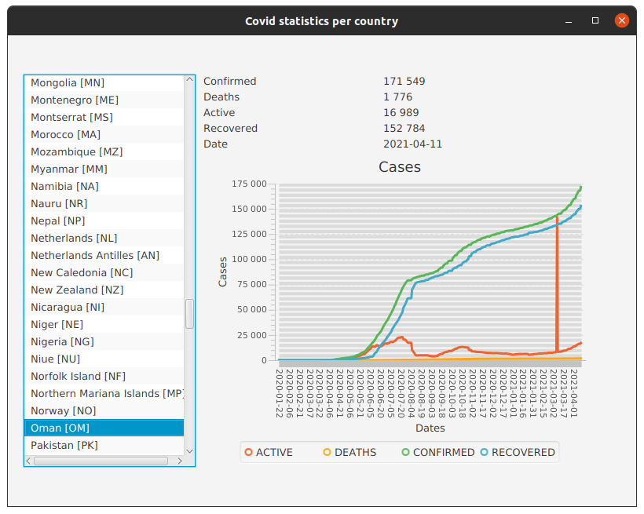

Application
-----------
This sample application is an accompying resource for mini-series of javafx tutorials available at:
[Prosta aplikacja w javafx -statystyki covid - tutorial](https://kamilachyla.com/posts/prosta aplikacja w javafx statystyki covid tutorial/)
[Posta aplikacja w javafx (2) - czytamy dane z pliku](https://kamilachyla.com/posts/prosta aplikacja w javafx 2 czytamy dane z pliku/)
[Prosta aplikacja w javafx (3) - sięgamy po dane przy użyciu klasy httpclient](https://kamilachyla.com/posts/prosta aplikacja w javafx 3 siegamy po dane przy uzyciu klasy httpclient/)

Its aim is to display some covid-related data in javafx desktop application.

API usage
===
GET countries
---------------
curl  --location --request GET 'https://api.covid19api.com/countries' 

GET country stats
------------------
curl https://api.covid19api.com/total/country/poland 

Screenshot
==========

